# E-Commerce PTW - Use Case Diagram

This document presents the UML Use Case Diagram for the E-Commerce PTW app,
illustrating the interactions between actors and the system's use cases.

## Table of Contents

* [Use Case Diagram](https://www.google.com/search?q=%23use-case-diagram)

* [Actors](https://www.google.com/search?q=%23actors)

  * [Primary Actors](https://www.google.com/search?q=%23primary-actors)

  * [Secondary Actors](https://www.google.com/search?q=%23secondary-actors)

* [Business Rules](https://www.google.com/search?q=%23business-rules)

* [Use Cases](https://www.google.com/search?q=%23use-cases)

  * [UC-1: Add Products](https://www.google.com/search?q=%23uc-1-add-products)

  * [UC-2: Login](https://www.google.com/search?q=%23uc-2-login)

  * [UC-3: Logout](https://www.google.com/search?q=%23uc-3-logout)

  * [UC-4: View Available Products](https://www.google.com/search?q=%23uc-4-view-available-products)

  * [UC-5: Filter Products](https://www.google.com/search?q=%23uc-5-filter-products)

  * [UC-6: Add Product to Cart](https://www.google.com/search?q=%23uc-6-add-product-to-cart)

  * [UC-7: Review Shopping Cart](https://www.google.com/search?q=%23uc-7-review-shopping-cart)

  * [UC-8: Remove Product from Cart](https://www.google.com/search?q=%23uc-8-remove-product-from-cart)

  * [UC-9: Checkout Order](https://www.google.com/search?q=%23uc-9-checkout-order)

  * [UC-10: View Orders](https://www.google.com/search?q=%23uc-10-view-orders)

  * [UC-11: Cancel Order](https://www.google.com/search?q=%23uc-11-cancel-order)

  * [UC-12: Process Payment](https://www.google.com/search?q=%23uc-12-process-payment)

  * [UC-13: Update Personal Data](https://www.google.com/search?q=%23uc-13-update-personal-data)

  * [UC-14: Contact Help Desk](https://www.google.com/search?q=%23uc-14-contact-help-desk)

  * [UC-15: Review and Modify Orders](https://www.google.com/search?q=%23uc-15-review-and-modify-orders)

  * [UC-16: Review Stock Levels](https://www.google.com/search?q=%23uc-16-review-stock-levels)

* [Relationships](https://www.google.com/search?q=%23relationships)

  * [Prerequisite Relationships](https://www.google.com/search?q=%23prerequisite-relationships)

  * [Include Relationships](https://www.google.com/search?q=%23include-relationships)

  * [Extend Relationships](https://www.google.com/search?q=%23extend-relationships)

## Use Case Diagram

```mermaid
%%{init: {'theme':'base'}}%%
graph TB
    subgraph PTW["E-Commerce PTW"]
        UC1[Add Products]
        UC2[Login]
        UC3[Logout]
        UC4[View Available Products]
        UC5[Filter Products]
        UC6[Add Product to Cart]
        UC7[Review Shopping Cart]
        UC8[Remove Product from Cart]
        UC9[Checkout Order]
        UC10[View Orders]
        UC11[Cancel Order]
        UC12[Process Payment]
        UC13[Update Personal Data]
        UC14[Contact Help Desk]
        UC15[Review and Modify Orders]
        UC16[Review Stock Levels]
    end

    Client((Client))
    Admin((Admin))
  
    %% Admin Interactions
    Admin --> |uses| UC1
    Admin --> |uses| UC15
    Admin --> |uses| UC16
  
    %% Client Interactions
    Client --> |uses| UC2
    Client --> |uses| UC4
    Client --> |uses| UC6
    Client --> |uses| UC7
    Client --> |uses| UC8
    Client --> |uses| UC9
    Client --> |uses| UC10
    Client --> |uses| UC11
    Client --> |uses| UC13
    Client --> |uses| UC14
  
    %% Inheritance
    ImportAuto[CSV/JSON Import] -.-> |inherits| UC1
    ImportManual[Manual Product Management] -.-> |inherits| UC1
    
    %% Includes
    UC1 --> |includes| UC2
    UC8 --> |includes| UC7
    UC9 --> |includes| UC2
    UC9 --> |includes| UC12
    
    %% Extends
    UC3 -.-> |extends| UC2
    UC5 -.-> |extends| UC4
    UC6 -.-> |extends| UC4

    style PTW fill:#f9f9f9,stroke:#333,stroke-width:2px
    style Client fill:#e1f5ff,stroke:#333,stroke-width:2px
    style Admin fill:#ffe0b2,stroke:#333,stroke-width:2px

```

## Actors

### Primary Actors

* **Client**: A buyer of products that can browse the catalog, place/cancel orders

  * Authenticated user with access to all order and browsing features

  * Subject to order limits (stock limited)

### Secondary Actors

* **System Administrator**: External actor responsible for data management

  * Imports products list via CSV/JSON files and in app management interface

  * Order management and viewing capabilities

## Business Rules

1. **Order Limit**: As much as stock allows

2. **Availability**: Products are only available for purchase if they are in stock

3. **Session Management**: Users must be logged in to place orders, view order history

## Use Cases

### UC-1: Add Products

**Primary actor**
System Administrator

**Secondary actors**
None

**Description**
A System Administrator imports product data into the system by using CSV/JSON files.
The system validates the file format and data integrity before updating the product inventory in the database.
Error handling is implemented to manage invalid file formats and data integrity issues, ensuring that only valid records are processed.
A System Admin can resolve errors in the app and continue with the import process. If the admin wants to add more products,
he can simply place another file in the import directory and the system will process it as well or use the in-app product management.

**Trigger**
System Administrator wants to update the product list.

**Preconditions**

* PRE-1. CSV/JSON files are properly formatted.

* PRE-2. Product data is accurate and complete.

* PRE-3. Updated products are not currently in use in active orders.

**Postconditions**

* POST-1. Product data is updated in the database.

* POST-2. Existing stocks are not altered.

* POST-3. Import log is generated with success/failure status.

**Normal flow**
1.0 Import Data

1. System Administrator places CSV/JSON file in the import location.

2. System validates file format.

3. System parses file contents and validates data integrity.

4. System updates products.

5. System generates log.

**Alternative flows** 1.0 Manual Product Management

1. Admin accesses the in-app product management interface.

2. Admin adds/edits products manually.

3. System validates input data.

4. System updates product inventory.

5. System generates update log.

**Exceptions**
1.0.E1 Invalid file format

1. System detects that file format is invalid.

2. System generates error log with format validation details.

3. System moves file to error directory.

4. System terminates use case.

1.0.E2 Data integrity violation

1. System detects duplicate records or constraint violations.

2. System generates error log with specific data issues.

3. System skips invalid records and processes valid ones.

4. System generates partial import log.

### UC-2: Login

**Primary actor**
Client, System Administrator

**Secondary actors**
None

**Description**
A user authenticates with their credentials to access the store.
Upon successful login, the system directs the user to their role-specific dashboard.

**Trigger**
User navigates to the E-commerce app and requests to log in.

**Preconditions**

* PRE-1. User has a valid account in the system.

* PRE-2. User knows their username and password.

**Postconditions**

* POST-1. User session is established.

* POST-2. User is authenticated and authorized to access system features.

**Normal flow**
2.0 Login

1. User requests to log in to the system.

2. System displays login form.

3. User enters username and password.

4. System validates credentials against database.

5. System creates authenticated session for User.

6. System displays role-appropriate dashboard or catalog page.

**Exceptions**
2.0.E1 Invalid credentials

1. System detects that username or password is incorrect.

2. System displays error message indicating invalid credentials.

3. System returns to step 2 of normal flow.

4. If User fails authentication 5 times, system locks account temporarily.

2.0.E2 Account locked

1. System detects that account is locked due to multiple failed attempts.

2. System displays message indicating account is locked.

3. System terminates use case.

### UC-3: Logout

**Primary actor**
Client, System Administrator

**Secondary actors**
None

**Description**
A User securely terminates their authenticated session in the e-commerce app.

**Trigger**
User requests to log out of the system.

**Preconditions**

* PRE-1. User is logged in to the system.

**Postconditions**

* POST-1. User session is terminated.

* POST-2. User is redirected to login page.

**Normal flow**
3.0 Logout

1. User requests to log out.

2. System invalidates current session.

3. System clears any temporary data associated with the session.

4. System redirects User to login page.

5. System displays confirmation message.

### UC-4: View Available Products

**Primary actor**
Client

**Secondary actors**
None

**Description**
A Client views a complete list of products available in the catalog.
The list displays product details including name, type, size, material, price, available stock, and a picture.

**Trigger**
Client navigates to the catalog page.

**Preconditions**

* None

**Postconditions**

* POST-1. Complete product list is displayed to Client.

**Normal flow**
4.0 View Products

1. Client requests to view products.

2. System retrieves products list from database.

3. System retrieves stock quantity for all products.

4. System displays products list with details.

5. Client browses the product list.

### UC-5: Filter Products

**Primary actor**
Client

**Secondary actors**
None

**Description**
A Client applies filters to narrow down the product list by size, name, material, bearing diameter, bearing material, and maximum load.

**Trigger**
Client requests to filter the product list while viewing available products.

**Preconditions**

* PRE-1. Client is viewing the products list (UC-4).

**Postconditions**

* POST-1. Filtered products list is displayed.

* POST-2. Filter criteria are preserved during the session.

**Normal flow**
5.0 Filter Products

1. Client requests to apply filters.

2. System displays filter options.

3. Client selects filter type and enters filter criteria.

4. System applies filter to product list.

5. System displays filtered results.

6. Client views filtered product list.

**Exceptions**
5.0.E1 No results found

1. System finds no products matching filter criteria.

2. System displays message indicating no results.

3. System prompts Client to modify filter criteria.

### UC-6: Add Product to Cart

**Primary actor**
Client

**Secondary actors**
None

**Description**
A Client adds an available product to their shopping cart in preparation for checkout.
The system validates availability before adding the product.

**Trigger**
Client selects a product and requests to add it to the shopping cart.

**Preconditions**

* PRE-1. Client is viewing available products (UC-4).

* PRE-2. Selected product is currently in stock.

**Postconditions**

* POST-1. Product is added to Client's shopping cart.

* POST-2. Cart item count is updated.

**Normal flow**
6.0 Add Product to Cart

1. Client selects a product from the available products list.

2. Client requests to add product to cart.

3. System checks product availability status.

4. System adds product to shopping cart.

5. System displays confirmation message.

6. System updates cart item count display.

**Exceptions**
6.0.E1 Product not available

1. System detects stock depleted.

2. System displays message indicating product is unavailable.

3. System terminates use case.

### UC-7: Review Shopping Cart

**Primary actor**
Client

**Secondary actors**
None

**Description**
A Client reviews all products currently in their shopping cart before proceeding to checkout.
The Client can view cart contents, remove items, or proceed to finalize the order.

**Trigger**
Client navigates to the shopping cart to review items.

**Preconditions**

* None

**Postconditions**

* POST-1. Cart contents are displayed to Client.

* POST-2. Client can proceed to checkout or modify cart.

**Normal flow**
7.0 Review Shopping Cart

1. Client requests to view shopping cart.

2. System retrieves all items in Client's cart.

3. System displays cart with product details.

4. System displays total number of items in cart.

5. Client reviews cart contents.

**Exceptions**
7.0.E1 Empty cart

1. System detects cart is empty.

2. System displays message indicating cart is empty.

3. System prompts Client to browse products.

4. System terminates use case.

### UC-8: Remove Product from Cart

**Primary actor**
Client

**Secondary actors**
None

**Description**
A Client removes a product from their shopping cart before checkout.

**Trigger**
Client selects a product in the cart and requests to remove it.

**Preconditions**

* PRE-1. Client has at least one product in the shopping cart.

**Postconditions**

* POST-1. Selected product is removed from cart.

* POST-2. Cart item count is updated.

**Normal flow**
8.0 Remove Product from Cart

1. Client selects a product in the cart.

2. Client requests to remove the product.

3. System prompts for confirmation.

4. Client confirms removal.

5. System removes product from cart.

6. System updates cart item count.

7. System displays confirmation message.

### UC-9: Checkout Order

**Primary actor**
Client

**Secondary actors**
None

**Description**
A Client finalizes the order for the products in their cart.
The system creates the order record, updates product stock, clears the cart,
and displays order registration confirmation.

**Trigger**
Client confirms cart contents and requests to complete the checkout.

**Preconditions**

* PRE-1. Client is logged in to the system.

* PRE-2. Client has at least one product in the shopping cart.

* PRE-3. All products in cart are in stock.

**Postconditions**

* POST-1. Stock quantity for purchased products is decreased.

* POST-2. Order is created and status is set to registered/paid.

* POST-3. Shopping cart is cleared.

* POST-4. Client is redirected to orders view.

**Normal flow**
9.0 Checkout Order

1. Client requests checkout from cart review.

2. System validates all products in cart are still available.

3. System processes payment (UC-12).

4. System creates order records.

5. System updates product stock qty.

6. System clears shopping cart.

7. System displays current orders.

8. System displays success message with order details.

**Exceptions**
9.0.E1 Product no longer available

1. System detects one or more products in cart were purchased by another user.

2. System displays message listing unavailable products.

3. System removes unavailable products from cart.

4. System prompts Client to review updated cart.

### UC-10: View Orders

**Primary actor**
Client

**Secondary actors**
None

**Description**
A Client can see an overview of all their previous finished and current ongoing orders.

**Trigger**
Client navigates to the order history dashboard.

**Preconditions**

* PRE-1. Client is logged in to the system.

**Postconditions**

* POST-1. A list of current and past orders is displayed.

**Normal flow**
10.0 View Orders

1. Client requests to view their orders.

2. System retrieves the order history for the Client.

3. System displays the orders, categorized by status (e.g., ongoing, finished).

4. Client clicks on a specific order to view detailed items and status.

### UC-11: Cancel Order

**Primary actor**
Client

**Secondary actors**
None

**Description**
A Client can cancel orders that they have previously placed.

**Trigger**
Client selects an active order and requests to cancel it.

**Preconditions**

* PRE-1. Client is logged in.

* PRE-2. Client has an active, ongoing order that has not yet been shipped/finalized.

**Postconditions**

* POST-1. The order status is updated to "Cancelled".

* POST-2. Reserved stock quantities are returned to the available inventory.

**Normal flow**
11.0 Cancel Order

1. Client views order history and selects an ongoing order.

2. Client selects the cancel option.

3. System prompts for confirmation.

4. Client confirms cancellation.

5. System updates order status and restocks items.

6. System displays success message.

### UC-12: Process Payment

**Primary actor**
Client

**Secondary actors**
None

**Description**
Users, once they finalize their order, have the option for in-app payment via card.

**Trigger**
Client reaches the payment step during the checkout process.

**Preconditions**

* PRE-1. Client has initiated the checkout process (UC-9).

**Postconditions**

* POST-1. Payment is authorized and processed.

* POST-2. Order status is updated to reflect payment success.

**Normal flow**
12.0 Process Payment

1. System prompts Client for payment details.

2. Client enters card/payment information.

3. System validates payment via processing gateway.

4. System confirms successful transaction and passes control back to checkout.

### UC-13: Update Personal Data

**Primary actor**
Client

**Secondary actors**
None

**Description**
Users can update their personal profile data.

**Trigger**
Client navigates to their profile settings.

**Preconditions**

* PRE-1. Client is logged in.

**Postconditions**

* POST-1. Client's database record is updated with the new personal information.

**Normal flow**
13.0 Update Profile

1. Client requests to view profile.

2. System displays current personal data.

3. Client inputs new personal data and saves.

4. System validates and updates database records.

5. System displays success message.

### UC-14: Contact Help Desk

**Primary actor**
Client

**Secondary actors**
None

**Description**
Users have an option for contacting the company for custom wheels via an email-based help desk.

**Trigger**
Client navigates to the Help Desk/Contact page.

**Preconditions**

* None

**Postconditions**

* POST-1. An email inquiry is formatted and sent to the company administrators.

**Normal flow**
14.0 Contact Help Desk

1. Client navigates to contact page.

2. System displays email contact form.

3. Client inputs message details regarding custom solutions.

4. Client submits form.

5. System routes message to the Admin email queue and displays confirmation.

### UC-15: Review and Modify Orders

**Primary actor**
System Administrator

**Secondary actors**
None

**Description**
Admins can view all orders in the system and modify those orders accordingly.

**Trigger**
Admin navigates to the admin order management dashboard.

**Preconditions**

* PRE-1. Admin is logged in with administrative privileges.

**Postconditions**

* POST-1. The targeted order is updated based on the Admin's modifications.

**Normal flow**
15.0 Manage Orders

1. Admin requests to view all system orders.

2. System retrieves and displays comprehensive order list.

3. Admin selects an order to modify (e.g., change status to "Shipped").

4. System updates order and notifies Client if applicable.

### UC-16: Review Stock Levels

**Primary actor**
System Administrator

**Secondary actors**
None

**Description**
Admins can view current stock levels to monitor availability and assess if supply orders need to be generated.

**Trigger**
Admin navigates to the inventory dashboard.

**Preconditions**

* PRE-1. Admin is logged in with administrative privileges.

**Postconditions**

* POST-1. Inventory levels are displayed.

**Normal flow**
16.0 Monitor Stock

1. Admin requests to view inventory levels.

2. System aggregates and displays current stock counts for all products.

3. Admin reviews low-stock warnings to generate supply orders.

## Relationships

### Prerequisite Relationships

* **UC2 (Login) is required for authenticated client/admin use cases**:

  * UC1 (Add Products) requires UC2 (Admin auth)

  * UC3 (Logout) requires UC2

  * UC7 (Review Shopping Cart) requires UC2

  * UC9 (Checkout Order) requires UC2

  * UC10 (View Orders) requires UC2

  * UC11 (Cancel Order) requires UC2

  * UC13 (Update Personal Data) requires UC2

  * UC15 (Review and Modify Orders) requires UC2 (Admin auth)

  * UC16 (Review Stock Levels) requires UC2 (Admin auth)

### Include Relationships

* **UC8 (Remove Product from Cart) includes UC7 (Review Shopping Cart)**: You must interact with the cart to remove an item.

* **UC9 (Checkout Order) includes UC12 (Process Payment)**: The checkout flow inherently involves the payment step.

* **UC9 (Checkout Order) includes UC2 (Login)**: If not already authenticated, checkout triggers login.

### Extend Relationships

* **UC5 (Filter Products) extends UC4 (View Available Products)**: Filtering is an optional action while browsing the catalog.

* **UC6 (Add Product to Cart) extends UC4 (View Available Products)**: Adding to the cart is an optional action while viewing products.

* **UC3 (Logout) extends UC2 (Login)**: Logout is an optional flow stemming from being logged in.